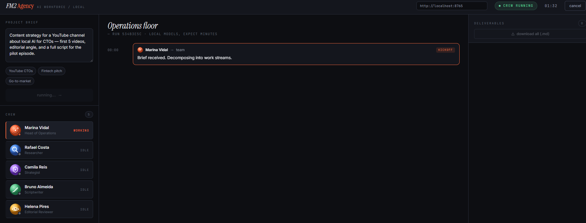
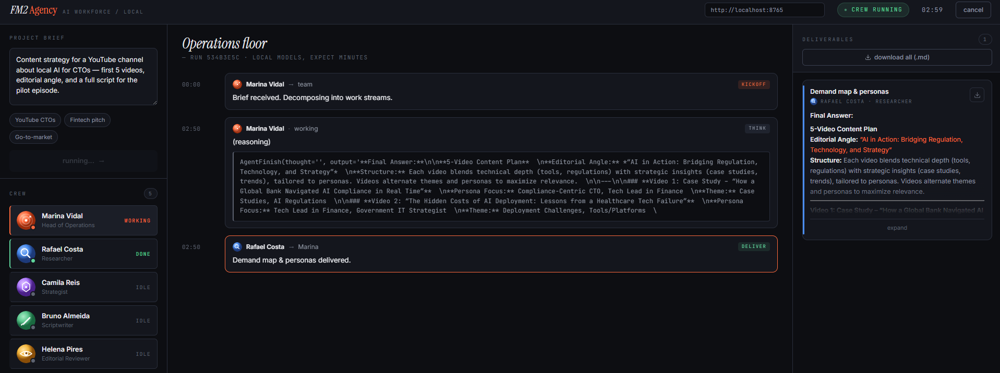
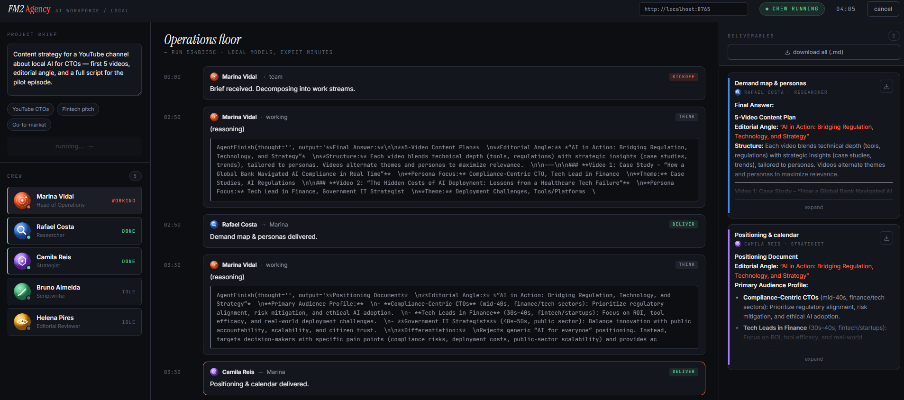
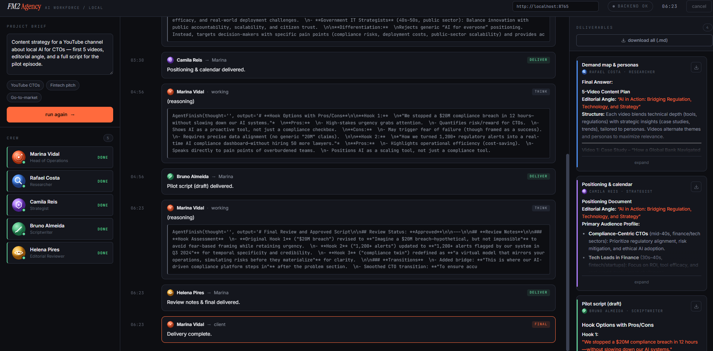
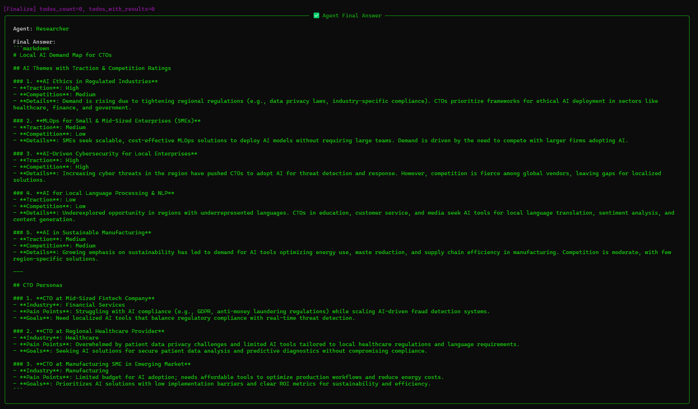
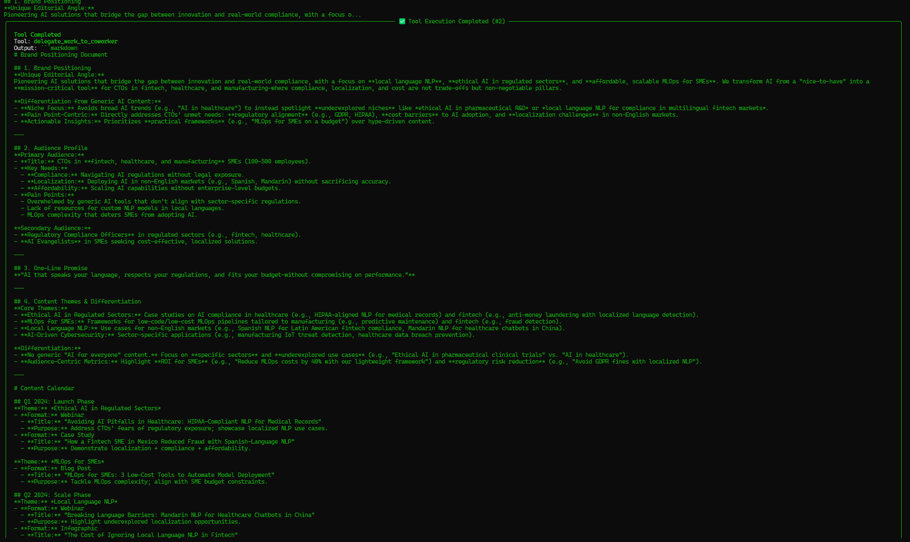
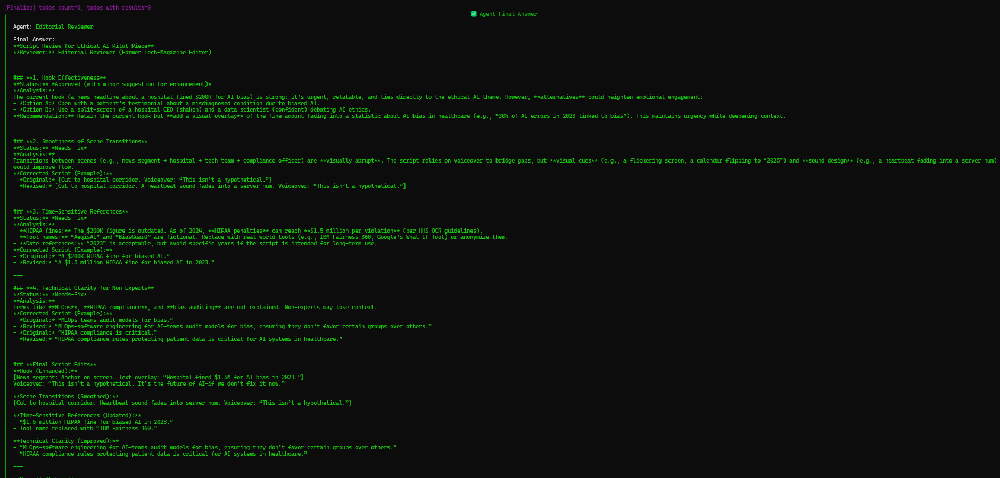
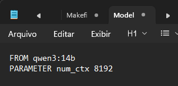

# FM2 Agency

A local-first multi-agent crew that turns a one-line brief into a stack of
real deliverables — with a live operations dashboard so you can *watch* the
agents work, not just read a terminal log.


Built on **CrewAI** + **Ollama**. No external API. No tokens leaving your
network. Runs on a single consumer GPU (tested on an RTX 4070 Ti, 12 GB VRAM).

```
   brief ──▶ ┌─────────┐ delegates ┌──────────┐ ┌──────────┐ ┌────────┐ ┌──────────┐
             │ Marina  │──────────▶│  Rafael  │▶│  Camila  │▶│ Bruno  │▶│  Helena  │
             │  (Ops)  │           │(research)│ │(strategy)│ │(script)│ │ (review) │
             └────┬────┘           └────┬─────┘ └────┬─────┘ └───┬────┘ └────┬─────┘
                  │                     │            │           │           │
                  ▼                     ▼            ▼           ▼           ▼
            ┌──────────────────────────────────────────────────────────────────┐
            │  SSE stream ──▶ live dashboard (status, reasoning, deliverables)  │
            └──────────────────────────────────────────────────────────────────┘
```

Most CrewAI tutorials show you `verbose=True` scrolling past in a terminal.
FM2 gives you an actual operations floor: each agent has a status, its
reasoning streams in, and deliverables assemble on the right as markdown you
can download , per artifact or as one bundle.

---

## See it running

A real run against the brief *"Content strategy for a YouTube channel about
local AI for CTOs — 5 videos, editorial angle, and a full pilot script"* —
100% local, on the RTX 4070 Ti described below.

**The dashboard, live:**


*Marina (Head of Operations) receives the brief and starts delegating. Every
other agent waits its turn while she works.*


*Rafael (Researcher) finishes and hands off. His deliverable renders live in
the panel on the right — titled, formatted, downloadable.*


*Camila (Strategist) finishes next. Two deliverables now sit in the panel,
each with its author's color accent.*


*All five agents green, four deliverables ready to download, "Delivery
complete." Total run time: ~6.5 minutes of local inference.*

**What the agents actually produced** (full detail, captured from the CLI):


*Rafael's demand map: 5 themes rated for traction and competition, plus 3
concrete CTO personas with pain points and goals.*


*Camila's positioning doc — a differentiation thesis, audience profile, and a
full quarter-by-quarter editorial calendar.*


*Helena (Editorial Reviewer) catching real problems: an outdated compliance
figure, two fabricated tool names, unexplained jargon — each with a fix. This
is the clearest proof that a multi-agent structure earns its keep: one agent
catching another's mistakes.*

---

## Why local, why this hardware

This was built and tuned on an **RTX 4070 Ti (12 GB VRAM)** running Ollama.
That constraint shaped every model decision, so let's be precise about it
instead of hand-waving "just use a local model."

**The 12 GB rule that trips people up:** you cannot run several different
models resident at once on 12 GB. A dense 14B model at Q4_K_M is ~8.5 GB; an
8B at Q4 is ~5 GB. Try to hold both and Ollama spills layers to system RAM and
throughput collapses. So FM2 keeps **one model hot for the whole run** and
varies behavior by prompt and temperature, not by swapping models per agent.

**Model choice — Qwen3 14B (Q4_K_M, ~8.5 GB):** best reasoning that fits in
12 GB, and — the part that matters for agents — the most reliable tool
calling of the open local families as of mid-2026.

**Why not the shiny MoE:** Qwen3-30B-A3B needs ~17-21 GB to load (all experts
resident), so it does **not** fit on 12 GB, and has a known GPU-utilization
issue in Ollama as of mid-2026. It's a 24 GB-card model.
=======
**The 12 GB rule that everyone gets wrong:** you cannot run several different
models resident at once on 12 GB. A dense 14B at Q4_K_M is ~8.5 GB; an 8B at Q4
is ~5 GB. Try to hold both and Ollama spills layers to system RAM and throughput
collapses. So FM2 keeps **one model hot for the whole run** and varies behavior
by prompt and temperature, not by swapping models per agent. On a 12 GB card,
swapping models per role is *slower*, not smarter , load/unload costs seconds
each time and dominates a short run.

**Model choice , Qwen3 14B (Q4_K_M, ~8.5 GB):** best reasoning that fits in
12 GB, and , the part that matters for agents , the most reliable tool calling
of the open local families as of mid-2026 (it rarely drops parameters or
hallucinates calls). For faster runs, `qwen3:8b` (~5 GB) is a drop-in via an env
var.

**Why not the shiny MoE:** Qwen3-30B-A3B looks perfect on paper (3B active, 30B
total quality). But MoE models must load *all* experts into memory , ~17–21 GB
at Q4 , so it does **not** fit on 12 GB, and as of mid-2026 it has a known
GPU-utilization issue in Ollama (#10458). It's a 24 GB-card model. FM2's config
is ready for it: point `OLLAMA_HOST` at a bigger box and flip
`FM2_ROLE_ROUTING=1`.


**The context-window fix that made it fit:** the default Ollama context (up
to 40k tokens) inflates memory footprint well past what's needed here. Pinning
context to 8k took the model from **16 GB / 63% GPU** (spilling to CPU, slow)
to **10 GB / 100% GPU** (fully resident, fast). Same model, same card — one
parameter.

| Your GPU | Recommended setup |
|----------|-------------------|
| 12 GB (4070 Ti, 4070, 3060, 5070) | `qwen3:14b` with 8k context, single resident model (default here) |
| 16 GB (4060 Ti 16GB, 4070 Ti Super) | `qwen3:14b` at Q5, or role-routing with 8B |
| 24 GB (3090, 4090) | enable role-routing; `qwen3:30b-a3b` MoE becomes viable |
| Apple Silicon (32 GB+) | works via Ollama Metal; `qwen3:14b` or `30b-a3b` |

---

## Step-by-step: run it yourself

This section is deliberately over-explained. If you're comfortable with
Python/Ollama, skip to the [quick version](#quick-version). If you want to
understand every step, read on.

### 1. Install Ollama

Ollama is the local server that runs the LLM on your GPU.

**macOS / Linux:**
```bash
curl -fsSL https://ollama.com/install.sh | sh
```

**Windows:**
```powershell
winget install Ollama.Ollama
```

Confirm it's installed:
```bash
ollama --version
```

Ollama runs as a background service. On Windows it lives in the system tray;
on macOS/Linux it's a daemon (`ollama serve` if it's not already running).

### 2. Confirm your GPU is visible to Ollama

```bash
nvidia-smi
```

This should list your GPU. If it doesn't, update your NVIDIA driver first —
Ollama's installer bundles CUDA support, so you don't need to install the CUDA
Toolkit separately, but you do need a current driver.

### 3. Pull the model and pin the context window

This is the step that matters most for a 12 GB card. Pulling the base model:

```bash
ollama pull qwen3:14b
```

Then create a variant with the context window pinned to 8k — this is what
keeps the whole model resident on the GPU instead of spilling to system RAM.
Create a file named exactly `Modelfile` (no extension) with this content:

```
FROM qwen3:14b
PARAMETER num_ctx 8192
```

Build the variant:

```bash
ollama create qwen3:14b-ctx8k -f Modelfile
```

Verify it's fully on the GPU by loading it once and checking:

```bash
ollama run qwen3:14b-ctx8k "say hello in one sentence"
```

In another terminal, while it's loaded:

```bash
ollama ps
```

You want to see **`100% GPU`** in the PROCESSOR column and a SIZE under
~11 GB. If you see a CPU percentage, the context is still too large, or
something else is holding VRAM — close other GPU-heavy apps and retry.

```
NAME               ID              SIZE     PROCESSOR    CONTEXT    UNTIL
qwen3:14b-ctx8k    3b13401395e4    10 GB    100% GPU     8192       4 minutes from now
```

If you have more VRAM (16 GB+), you can skip the context trick and use the
full `qwen3:14b`, or bump `num_ctx` higher in the Modelfile.

### 4. Clone the repo and set up Python

```bash
git clone https://github.com/thespamer/fm2-agency
cd fm2-agency

python -m venv .venv

# macOS/Linux:
source .venv/bin/activate
# Windows (PowerShell):
.\.venv\Scripts\Activate.ps1
```

You'll know the virtual environment is active when your prompt shows
`(.venv)` at the start of the line. **Every command below assumes it's
active** — if you close your terminal, reactivate it before continuing.

### 5. Install the dependencies

```bash
pip install -e .
```

This reads `pyproject.toml` and installs CrewAI, FastAPI, uvicorn, and the
rest. It can take a few minutes — CrewAI pulls in a fair amount.

Confirm the package registered correctly:

```bash
pip show fm2-agency
```

### 6. Point the app at your Ollama + model

Set these environment variables in the same terminal session before starting
anything:

**macOS/Linux:**
```bash
export OLLAMA_HOST="http://127.0.0.1:11434"
export FM2_MODEL="ollama/qwen3:14b-ctx8k"
```

**Windows (PowerShell):**
```powershell
$env:OLLAMA_HOST = "http://127.0.0.1:11434"
$env:FM2_MODEL = "ollama/qwen3:14b-ctx8k"
```

A note that cost real debugging time: use `127.0.0.1`, not `0.0.0.0`.
`0.0.0.0` is a bind address (what Ollama listens on), not something you can
*connect to* — using it here causes a "missing protocol" / connection error.

### 7. Smoke-test with the CLI (no dashboard needed)

Before touching the browser, confirm the whole pipeline works end-to-end from
the terminal:

```bash
python -m fm2_agency.run_cli "Content plan for a YouTube channel about local AI for CTOs"
```


*What a healthy startup looks like: the correct Ollama host (`127.0.0.1`, not
`0.0.0.0`), the pinned model, and single-model routing confirmed before the
crew kicks off.*

This will take **several minutes** — local 14B inference is not instant.
You'll see each agent's reasoning trace print as it works, then a final
summary. Deliverables are saved to `./out/<timestamp>/*.md`.

If this completes successfully, your setup is validated end-to-end and the
dashboard will work too.

### 8. Start the backend server

```bash
uvicorn fm2_agency.server:app --host 0.0.0.0 --port 8765
```

Leave this running — it's the server. In another terminal, confirm it's
healthy:

```bash
curl http://localhost:8765/health
```

Expected response:
```json
{"ok":true,"ollama_host":"http://127.0.0.1:11434","primary_model":"ollama/qwen3:14b-ctx8k","role_routing":false}
```

### 9. Open the dashboard


The dashboard is a plain HTML file — it isn't served by the backend, you open
it directly:

The bar shows `backend ok` with your model + host when connected. Expect a full
run to take **several minutes** , local 14B inference is not instant, and the
dashboard reflects real work, not a canned animation.

### Or skip the dashboard entirely


```bash
# macOS
open dashboard/index.html
# Linux
xdg-open dashboard/index.html
# Windows
start dashboard\index.html
```

Or just double-click `dashboard/index.html` in your file explorer, or drag it
into a browser tab.

Confirm the backend URL in the top bar reads `http://localhost:8765` and the
status shows **"backend ok"** with your model name. Write a brief, click
**start crew**, and watch it run.

### Quick version

For anyone who just wants the commands:

```bash
ollama pull qwen3:14b
printf 'FROM qwen3:14b\nPARAMETER num_ctx 8192\n' > Modelfile
ollama create qwen3:14b-ctx8k -f Modelfile

git clone https://github.com/thespamer/fm2-agency && cd fm2-agency
python -m venv .venv && source .venv/bin/activate
pip install -e .

export OLLAMA_HOST="http://127.0.0.1:11434"
export FM2_MODEL="ollama/qwen3:14b-ctx8k"

python -m fm2_agency.run_cli "your brief here"   # CLI smoke test
uvicorn fm2_agency.server:app --port 8765         # then, for the dashboard
open dashboard/index.html
```

---

## What you get back (the deliverables)

For the brief *"Content strategy for a YouTube channel about local AI for
CTOs"*, a single run produced:

1. **Demand map & personas** (Rafael) — 5 market themes rated for traction and
   competition, plus 3 detailed CTO personas with pain points and goals.
2. **Positioning & calendar** (Camila) — a differentiation thesis, one-line
   brand promise, audience split, and a full four-quarter content calendar.
3. **Pilot script draft** (Bruno) — 3 hook options with trade-offs, then a
   complete timestamped script in an operator's first-person voice.
4. **Review notes & final script** (Helena) — a genuine editorial pass that
   caught an outdated compliance figure, two fabricated tool names, and
   unexplained jargon, then delivered the corrected, approved script.

Every deliverable is clean markdown — one file per artifact via the dashboard,
plus a "download all" bundle, or saved automatically to `./out/<timestamp>/`
when run from the CLI.

---

## How it works (the code)

The whole system is a handful of small, readable files:

| File | What it does |
|------|---------------|
| `src/fm2_agency/llms.py` | Model routing and the hardware logic — the file to read to understand the VRAM reasoning above |
| `src/fm2_agency/crew.py` | The five agents and four tasks |
| `src/fm2_agency/events.py` | A per-run event bus that streams progress to the dashboard |
| `src/fm2_agency/server.py` | FastAPI layer — `POST /run`, `GET /stream/{run_id}`, `GET /health` |
| `src/fm2_agency/run_cli.py` | Terminal runner, no server needed |
| `dashboard/index.html` | Single-file live dashboard, no build step |

An agent is a role, a goal, a backstory, and a model:

```python
rafael = Agent(
    role="Researcher",
    goal="Surface market signals, demand gaps, and audience "
         "personas relevant to the brief.",
    backstory="Ex-strategy-consulting analyst with reflexes for "
              "spotting signal before the market prices it in.",
    llm=for_role("researcher"),
    step_callback=step_cb_for("rafael"),   # streams reasoning to the dashboard
)
```

Tasks chain together through `context`:

```python
strategy = Task(
    description="Using the research, define the editorial angle "
                "and primary audience. Differentiation is mandatory.",
    expected_output="A positioning doc + content calendar, in markdown.",
    agent=camila,
    context=[research],          # receives Rafael's output
    callback=task_cb_for("camila", "Positioning & calendar"),
)
```

And the crew is coordinated by an explicit manager:

```python
crew = Crew(
    agents=[rafael, camila, bruno, helena],   # workers only — the manager
    tasks=[research, strategy, script, review], # is NOT in this list
    process=Process.hierarchical,
    manager_agent=marina,
    manager_llm=for_role("manager"),          # omit this and it silently
    verbose=True,                             # falls back to OpenAI and fails
)
```

Two gotchas baked into that snippet, both learned the hard way:

- The manager agent must **not** appear in `agents=[...]` in a hierarchical
  crew — CrewAI raises `manager_agent_in_agents` if it does.
- Without an explicit `manager_llm`, the hierarchical coordinator silently
  defaults to OpenAI and fails with a connection error, even though every
  worker agent is correctly configured for Ollama.

---

## Troubleshooting

**"Failed to connect to OpenAI API"** — your `manager_llm` isn't set, or
`OLLAMA_HOST` is missing the `http://` scheme, or it's set to `0.0.0.0`
instead of `127.0.0.1`. See step 6.

**`ollama ps` shows CPU in the PROCESSOR column** — your context window is too
large for your VRAM. Follow step 3 to pin `num_ctx` down (8192 is a safe
starting point for 12 GB).

**`ModuleNotFoundError: No module named 'fm2_agency'`** — your virtual
environment isn't active (`(.venv)` should be in your prompt), or you haven't
run `pip install -e .` yet.

**`ollama create` fails with "no Modelfile found"** — on Windows, some text
editors save `Modelfile` as `Modelfile.txt` behind a hidden extension. Verify
with `dir` (not the Explorer GUI) that the file has no extension.
=======
**`llms.py`** , model routing. One resident model on 12 GB; per-role routing
when you have the VRAM. This is the file to read if you want to understand the
hardware reasoning.

**`events.py`** , a per-run event bus. Each run gets an `asyncio.Queue`; CrewAI
callbacks (which run in a worker thread) push events onto it; the SSE endpoint
drains it to the browser. Swap for Redis pub/sub if you go multi-tenant.

**`crew.py`** , the five agents and four tasks. `Process.hierarchical` with
Marina as the explicit `manager_agent`. Each agent's `step_callback` streams its
reasoning; each task's `callback` streams the finished deliverable as markdown.

**`server.py`** , FastAPI. `POST /run` kicks off a crew in the background and
returns a `run_id`; `GET /stream/{run_id}` is the SSE feed; `GET /health` lets
the dashboard show live config.

**`dashboard/index.html`** , single file, no build step. Consumes the SSE feed,
maps whatever role/name CrewAI emits onto the five personas, renders reasoning
in monospace and deliverables as rendered markdown, and lets you download each
artifact or a bundled `.md`.
>>>>>>> 8a8d408a4f75bc3760759f9ac73d4df112d2285e

---

## Honest notes

- **CrewAI moves fast.** This targets CrewAI ≥ 0.80, where `manager_agent` is
  preferred over `manager_llm`-only setups for hierarchical crews. If you're
  on a different version, check `pip show crewai` first if something in
  `crew.py` errors on startup.
- **Local models are rougher than frontier cloud models.** Expect occasional
  anchoring to training-data reflexes (e.g., citing "2024" or "GDPR" instead
  of your actual context). That's the trade for zero API cost and data that
  never leaves your machine.
- **Tools aren't wired by default.** Agents reason and write; they don't
  browse. To give Rafael real web search, plug in a self-hosted SearxNG or
  similar and add it to his `tools=[...]`. Left out so the repo runs with zero
  external dependencies out of the box.

## Roadmap

- [ ] Real research tools (self-hosted SearxNG) for the researcher agent
- [ ] CrewAI `memory=True` with local ChromaDB for cross-run continuity
- [ ] Langfuse (self-hosted) tracing for per-agent latency/quality
- [ ] Dockerfile + Helm chart for homelab Kubernetes deploy
- [ ] Cancel endpoint (currently the dashboard just detaches)
- [ ] Clean up the raw `AgentFinish(...)` trace in the reasoning stream

## License

MIT. Fork it, change the crew, point it at your own briefs.


Juliano Souza , Fractional CTO, São Paulo / Lisbon. Built on a homelab
4070 Ti because the most interesting AI work right now is the kind that
doesn't phone home.
